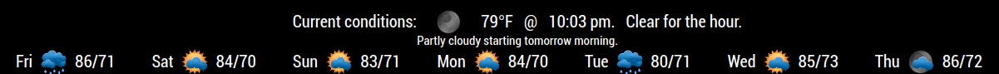
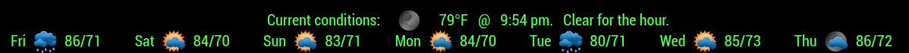

## MMM-BMW-DS

**Bugger My Weather** DarkSky

## Same church, different pew

I wanted to take a new approach at a weather module. Until now, I had only done WWI and WWI2 but I
wasn't really happy with those, although they were fun to do. This has a bit more style to it (not much)
and it doesn't resemble other modules in format or appearance. I learned a couple of new things while
doing it and I used what I learned in the module itself. Nothing monumental but very satisfying for me.

## Good-bye bottom_bar (Well, not really)

* This was designed for use in the bottom_bar position of your MagicMirror
* Can share bottom bar position with newsfeed module via Hello_Lucy
See here: https://www.youtube.com/watch?v=mTGoxM6JyBE
* Minutely updates for current conditions
* CSS provided for coloring and sizing. Make it your own.

## Examples

* Default white

* Colored and summary hidden

## Installation and requirements

* `git clone https://github.com/mykle1/MMM-BMW-DS` into the `~/MagicMirror/modules` directory.

* Free API key at `https://www.darksky.net` (Required)

* No dependencies needed! No kidding!

## Config.js entry and options

    {
		disabled: false,
		module: "MMM-BMW-DS",
		position: "bottom_bar",               // bottom_bar is best
		config: {
                apiKey: "YOUR API KEY GOES HERE",     // Free API key @ darksky.net
                tempUnits: "F",		              // C of F
                lat: 'YOUR LATITUDE GOES HERE', 
                lng: 'YOUR LONGITUDE GOES HERE',
		    css: '1',                         // 1-6 (Default, Clean, Lord of the Rings, Handwriting . . .)
                useHeader: false,               
                header: "Your header",
                maxWidth: "100%",
		}
	},
	

## Thanks to "Big Salty" for suggesting a rewrite of MMM-BMW

* The original MMM-BMW is still available. However, it requires an older WunderGround API key

